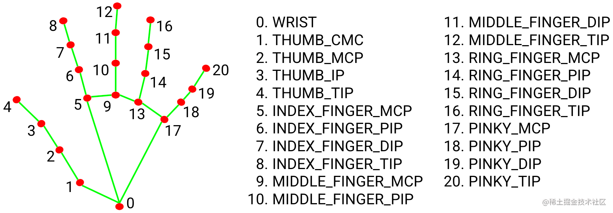

# 🖱️ AirMouse - Hand Gesture Virtual Mouse Control

AirMouse is a Python-based application that converts hand gestures detected through your webcam into mouse movements and clicks. It uses **MediaPipe** for hand detection and **OpenCV** for real-time video processing.

## Features ✨

- **🖐️ Hand Gesture Mouse Control**: Move your cursor by moving your index finger in front of the camera
- **👌 Click Detection**: Pinch your thumb and index finger together to perform a left click
- **✊ Fist Detection**: Make a fist gesture to trigger right-click and advanced functionality
- **🎯 Smooth Cursor Movement**: Built-in smoothing algorithm to reduce jitter
- **📹 Real-time Hand Tracking**: Visualizes detected hand landmarks on the video feed
- **⚙️ Customizable Settings**: Easily adjustable parameters for sensitivity and behavior

## Requirements 📋

- Python 3.7+
- Webcam/Camera 📷
- Libraries:
  - `opencv-python` (cv2)
  - `mediapipe`
  - `pyautogui`
  - `numpy`

## Installation 🚀

1. **Clone the repository** (or download the files):
```bash
git clone <https://github.com/AchalTyagi/Air-Mouse>
cd AirMouse
```

2. **Install required packages**:
```bash
pip install opencv-python mediapipe pyautogui numpy
```

3. **Run the application**:
```bash
python AirMouse.py
```

## How to Use 👆

### Gestures & Controls

| Action | Hand | Gesture | Visual Cue |
|---------|--------|---------|--------|
| **Move Cursor** | **LEFT** | Point **Index Finger** up | Yellow Circle on Index Tip |
| **Scroll Mode** | **LEFT** | Raise **Index + Middle Fingers** (Peace Sign) | Purple Text "SCROLL" |
| **Scroll UP** | **LEFT** | Hold Peace Sign **Above** the Purple Line | Text "SCROLL UP" (Green) |
| **Scroll DOWN** | **LEFT** | Hold Peace Sign **Below** the Purple Line | Text "SCROLL DOWN" (Green) |
| **Left Click** | **RIGHT** | **Pinch** Index Finger + Thumb together | Green Circle on fingers |
| **Right Click** | **RIGHT** | Make a **Fist** | Text "RIGHT CLICK" |
| **Exit App** | **BOTH** | Hold **Fists** with **Both** hands for 5 seconds | Red Countdown Timer |


## Configuration ⚙️

You can adjust the behavior by modifying the variables at the top of the Python script:

```python
# --- Tuning Parameters ---
frame_reduction = 100    # Increases sensitivity (less hand movement needed)
min_smooth = 2           # Lower = Faster cursor response
max_smooth = 15          # Higher = Smoother/Slower cursor
scroll_speed = 20        # How fast the page scrolls
scroll_line_y = 150      # Vertical position of the scroll threshold line
click_threshold = 40     # Distance between fingers to register a pinch
safety_delay = 2.0       # Delay before allowing Left Click after a Right Click
```

## How It Works 🧠

1. **Hand Detection**: Uses MediaPipe's pre-trained hand detection model to identify hand landmarks in real-time
2. **Landmark Identification**:
   - Landmark 8: Index finger tip (controls cursor position)
   - Landmark 4: Thumb tip (for click gestures)
3. **Gesture Recognition**: Calculates distances between landmarks to detect pinch and fist gestures
4. **Mouse Control**: Converts hand coordinates to screen coordinates and moves the cursor accordingly
5. **Smoothing**: Applies a smoothing algorithm to reduce cursor jitter

## Troubleshooting 🔧

1. **Cursor is jittery:** Ensure you are in a well-lit room. Dark lighting reduces tracking accuracy.
2. **Scroll isn't working:** Make sure both your Index and Middle fingers are clearly visible and extended.
3. **Right click firing too often:** Ensure your Right Hand is clearly open when you don't intend to click.
4. **Program crashes when moving to corner**: This version has `pyautogui.FAILSAFE = False` to prevent this, but be careful not to trap your mouse in a corner if the program hangs.

## Performance Tips 💡

- Close unnecessary applications to improve performance
- Use good lighting conditions for better detection
- Position your hand 1-2 feet away from the camera for optimal results
- Avoid rapid hand movements for more stable tracking

## Limitations ⚠️

- Requires consistent lighting
- Works best with one hand at a time
- May have latency on slower systems
- Not suitable for precision tasks (typing, drawing)

## Future Enhancements 🚀

- Multi-hand support with separate tracking
- Gesture customization
- Drag and drop functionality
- 🔄 Scroll wheel support
- Machine learning-based gesture training
- Further changes can be made in the program by taking in reference of this image
 

## Note

Created as a creative computer vision project using MediaPipe and OpenCV. Fell free to contribute in this project.

---

